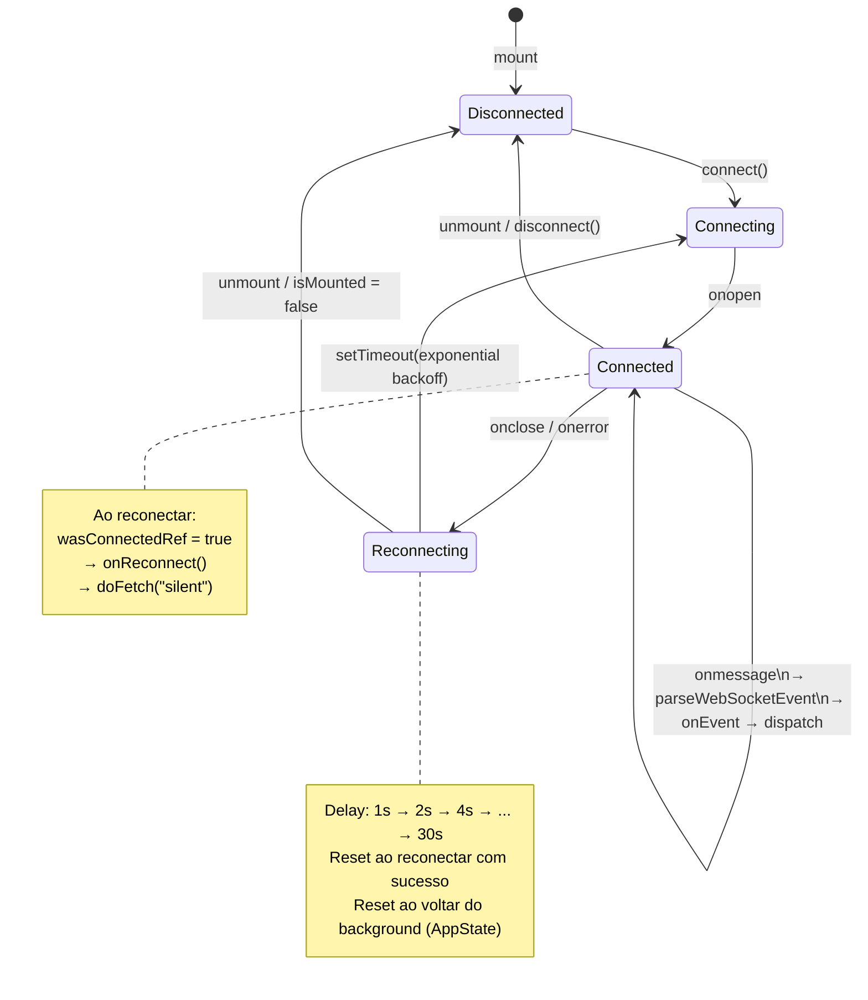
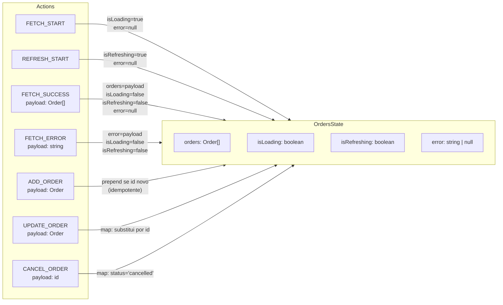
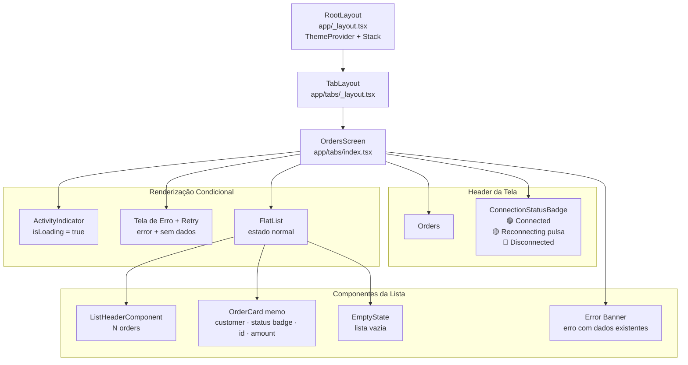
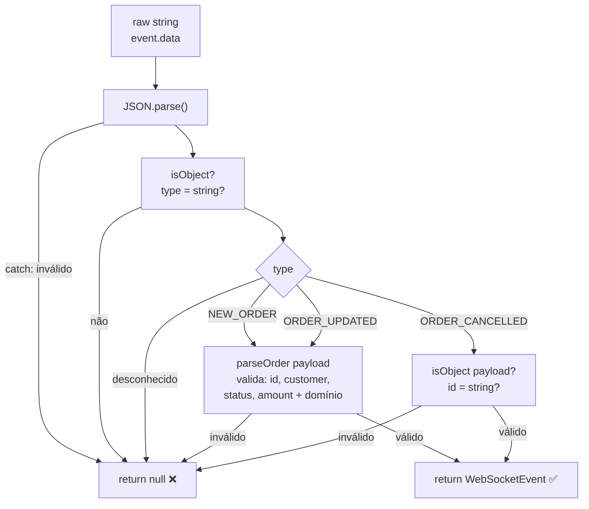

# Arquitetura do App

## Índice de Arquivos

| Camada | Arquivo |
|---|---|
| Backend mock | [`server/index.js`](./server/index.js) |
| Tipos | [`types/order.ts`](./types/order.ts) |
| Config | [`services/config.ts`](./services/config.ts) |
| HTTP | [`services/api.ts`](./services/api.ts) |
| Validação WS | [`services/validation.ts`](./services/validation.ts) |
| Reducer | [`hooks/orders-reducer.ts`](./hooks/orders-reducer.ts) |
| Hook WebSocket | [`hooks/use-websocket.ts`](./hooks/use-websocket.ts) |
| Hook Orders | [`hooks/use-orders.ts`](./hooks/use-orders.ts) |
| Tela principal | [`app/(tabs)/index.tsx`](./app/(tabs)/index.tsx) |
| Layout tabs | [`app/(tabs)/_layout.tsx`](./app/(tabs)/_layout.tsx) |
| Layout root | [`app/_layout.tsx`](./app/_layout.tsx) |
| OrderCard | [`components/order-card.tsx`](./components/order-card.tsx) |
| ConnectionStatus | [`components/connection-status.tsx`](./components/connection-status.tsx) |
| EmptyState | [`components/empty-state.tsx`](./components/empty-state.tsx) |
| Testes reducer | [`__tests__/orders-reducer.test.ts`](./__tests__/orders-reducer.test.ts) |
| Testes validação | [`__tests__/validation.test.ts`](./__tests__/validation.test.ts) |

---

## 1. Fluxo de Dados Geral

```mermaid
flowchart TD
    subgraph Backend["🖥️ Backend (Mock Server — porta 3001)"]
        HTTP["GET /orders\nHTTP REST"]
        WS["WebSocket\nws://localhost:3001"]
        SIM["Simulador de Eventos\n(a cada 5–12s)"]
        SIM -->|NEW_ORDER\nORDER_UPDATED\nORDER_CANCELLED| WS
    end

    subgraph Services["📦 services/"]
        API["api.ts\nfetchOrders()"]
        VAL["validation.ts\nparseWebSocketEvent()"]
        CFG["config.ts\nAPI_BASE_URL / WS_URL"]
    end

    subgraph Hooks["🪝 hooks/"]
        UWS["useWebSocket\n• conecta ao WS\n• exponential backoff\n• AppState listener"]
        UO["useOrders\n• despacha actions\n• chama doFetch\n• aciona animações"]
        RED["ordersReducer\n(função pura)"]
    end

    subgraph UI["📱 UI"]
        SCR["OrdersScreen\n(index.tsx)"]
        BADGE["ConnectionStatusBadge"]
        CARD["OrderCard (memo)"]
        EMPTY["EmptyState"]
    end

    HTTP -->|resposta JSON| API
    WS -->|mensagem raw string| VAL
    CFG --> API
    CFG --> UWS

    API -->|Order[]| UO
    VAL -->|WebSocketEvent| UWS
    UWS -->|onEvent| UO
    UWS -->|onReconnect → doFetch silent| UO
    UWS -->|ConnectionStatus| UO

    UO -->|dispatch| RED
    RED -->|novo estado| UO

    UO -->|orders, isLoading\nisRefreshing, error\nconnectionStatus| SCR
    SCR --> BADGE
    SCR --> CARD
    SCR --> EMPTY

    click SIM "server/index.js" "server/index.js"
    click HTTP "server/index.js" "server/index.js"
    click WS "server/index.js" "server/index.js"
    click API "services/api.ts" "services/api.ts"
    click VAL "services/validation.ts" "services/validation.ts"
    click CFG "services/config.ts" "services/config.ts"
    click UWS "hooks/use-websocket.ts" "hooks/use-websocket.ts"
    click UO "hooks/use-orders.ts" "hooks/use-orders.ts"
    click RED "hooks/orders-reducer.ts" "hooks/orders-reducer.ts"
    click SCR "app/(tabs)/index.tsx" "app/(tabs)/index.tsx"
    click BADGE "components/connection-status.tsx" "components/connection-status.tsx"
    click CARD "components/order-card.tsx" "components/order-card.tsx"
    click EMPTY "components/empty-state.tsx" "components/empty-state.tsx"
```

---

## 2. Ciclo de Vida da Conexão WebSocket



> Implementação: [`hooks/use-websocket.ts`](./hooks/use-websocket.ts)

---

## 3. Gerenciamento de Estado — Reducer



> Implementação: [`hooks/orders-reducer.ts`](./hooks/orders-reducer.ts) · Testes: [`__tests__/orders-reducer.test.ts`](./__tests__/orders-reducer.test.ts)

---

## 4. Árvore de Componentes



---

## 5. Validação de Eventos WebSocket



> Implementação: [`services/validation.ts`](./services/validation.ts) · Testes: [`__tests__/validation.test.ts`](./__tests__/validation.test.ts)
